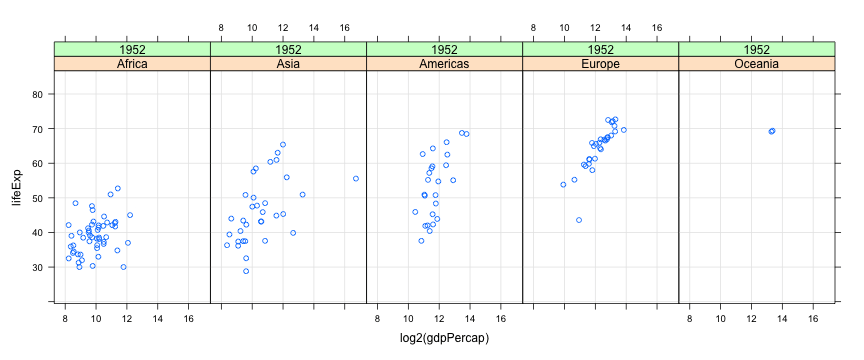

layout: true

# Data Visualization

---

* Important component of data analysis

--

* Main purposes

	- Exploration

	- Presentation

--

* Learning objectives

	- What kind of visualization to use

	- How to create them


```{r opts, echo = FALSE, results = "hide", warning = FALSE, message = FALSE}
library(knitr)
library(kableExtra)
opts_chunk$set(cache = TRUE, cache.path='~/knitr-cache/darp-viz-intro/', autodep = TRUE,
               comment = "", warning = TRUE, message = TRUE,
               fig.width = 12, fig.height = 5.5,
               dev = "svglite", dev.args = list(pointsize = 15, bg = "transparent"),
               knitr.table.format = "html",
               fig.path='figures/6-vizintro-')
options(warnPartialMatchDollar = FALSE, width = 90) # 110
```


<div>
$$
\newcommand{\sub}{_}
$$
</div>

---

layout: false

# Example datasets: `airquality` (size: small)

```{r}
str(airquality) # built-in dataset
```

???

We will use three example datasets for illustration.

These are of varying sizes, so that we get a sense of the special
issues that can arise with large datasets.

In real life, a lot of time is usually spent on collecting, combining,
and summarizing the data before they are ready for analysis. That
aspect is important, but we will not go into it right now.

Instead, we will assume that data has already been suitably
processed, and is available to us in a simple spreadsheet or data
frame format.

The first dataset we will consider is a simple built-in dataset in R,

- giving daily air quality measurements in New York City,

- over five months in 1973.

It has 153 observations, one for each day from May through September.

---

# Example datasets: `airquality` (size: small)

```{r}
head(airquality, 15)
```

???

Here, the HEAD function shows the first 15 rows of the dataset.

Notice that there are some NA values, which indicate missing data.

Also notice that dates are specified separately in MONTH and DAY
columns, and MONTH is indicated by number rather than name.

---

# Example datasets: `gapminder` (size: moderate)


```{r}
gapminder <- read.table("data/gapminder.tsv", sep = "\t", header = TRUE)
str(gapminder)
```

???

The second dataset is the GAPMINDER data we have seen earlier.

It has 1698 observations, much larger than the previous dataset.

---

# Example datasets: `gapminder` (size: moderate)


```{r}
subset(gapminder, country == "Australia")
```

???

But this large size is mainly due to the fact that the dataset
contains records for many countries.

If we restrict our attention to the subset for Australia, for example,
we see that there are only 12 observations.

We will talk about the SUBSET function in more detail later on.


<!-- --- -->

<!-- # Example datasets: `measles` (size: moderate)  -->


<!-- r -->
<!-- measles <- read.csv("data/measles.csv") -->
<!-- str(measles) # 'rate' is number of measles cases per 100,000 people -->
<!--   -->

<!-- ??? -->

<!-- Another dataset we will use is the measles data that records the  -->

<!-- - rate of measles incidences, -->

<!-- - per 100,000 people, -->

<!-- - in various US states from 1928 to 2003. -->

<!-- --- -->

<!-- # Example datasets: `measles` (size: moderate)  -->


<!-- r -->
<!-- head(measles, 15) -->
<!--   -->

<!-- ??? -->

<!-- Here also, we see some missing values. -->

<!-- For the purpose of visualization, we will assume that these missing -->
<!-- values are actually zero. -->

---

# Example datasets: `NHANES` (size: somewhat large)


```{r}
library(package = "NHANES")
str(NHANES)
```

---

# The goal of data visualization

* Visualizations help us study relationships

* This is enabled by comparison


---

# What do we study using visualization?

- Univariate distributions

- Bivariate and trivariate (generally multivariate) relationships

- Special case: Relationship with time (time-series) or space (spatial)


---

class: center, middle

# Univariate Data

---

# The `plot()` function

```{r}
plot(airquality$Ozone)
```


---

# Univariate distributions: strip charts or dot plots

```{r}
stripchart(airquality$Ozone)
```

---

# Univariate distributions: strip charts or dot plots

```{r}
stripchart(airquality$Ozone, method = "stack", pch = 16)
```

???

We specify the PCH argument to change the PLOTTING CHARACTER.

You should try other values like 1, 2, 3, and so on, and see what
results you get.


---

# Univariate distributions: comparative strip charts

```{r}
stripchart(Ozone ~ factor(Month), data = airquality,
           method = "stack", pch = 16)
```

???

So far, we have mapped all the points to the same Y-AXIS position, but
we can easily put that axis to better use.

As I mentioned earlier, data plots become more effective when they
enable comparison.

We have already seen in the first example, where we created a time
series plot without really meaning to, that the ozone concentration
varies over time.

To make this comparison more deliberately, suppose we want to make
SEPARATE strip charts for each month.

We can achieve this by mapping different months to different positions
on the Y-AXIS.

There are TWO new things to note in this call.

First, we use a call to the FACTOR function to convert the numeric
values of month to a categorical variable. This is not strictly
necessary, but it clearly signals our INTENT that month should be
treated as a categorical variable.

Second, we specify the grouping variable using a symbolic formula
notation, similar to the one we have seen before with LM.

This _formula notation_ is a recurrent theme that you will encounter in many
places when using R. It works in conjunction with the DATA argument,
which specifies the dataset in which the variables in the formula are
to be found.

The alternative would have been to use the DOLLAR notation, but this
would require referring to the dataset EVERY TIME a variable is
specified.


---

# Univariate distributions: comparative strip charts

```{r}
airquality$Month <- factor(airquality$Month, labels = month.abb[5:9])
stripchart(Temp ~ factor(Month, labels = month.abb[5:9]),
           data = airquality, method = "stack", pch = 16)
```

???

The next plot is similar, with two changes.

First, we convert the MONTH variable to a factor variable in the
dataset itself, so that we dont have to do it again and again for
every plot. We also add more informative labels, making the resulting
plots easier to interpret.

The other change is that we now plot temperature rather than ozone
concentration on the X-AXIS, which clearly shows much more
month-to-month variation.


---

# Univariate distributions: comparative strip charts

```{r}
stripchart(lifeExp ~ reorder(continent, lifeExp), data = gapminder,
           method = "stack", pch = 16, las = 1)
```

???

Unfortunately, this idea of stacking no longer works for moderately
sized datasets, or when there are very few ties.

Here we have plotted life expectancy in the GAPMINDER dataset, for
different countries and time periods, grouping them into different
continents.

Instead of ordering the continents arbitrarily, we order them by
average life expectancy using the REORDER function.

Of course it is not really OK to combine all years together, but even
then we see that Africa and Asia are continents with the lowest life
expectancy on average, which is not surprising.

Unfortunately, that's more or less ALL we can see. As there are not
that many ties in the data, there is no benefit to stacking.

We also set the LAS argument to ONE, making the Y-AXIS labels
horizontal rather than vertical. LAS stands for LABEL STYLE.

Although this looks better than vertical labels, notice that one of
the labels is CUT OFF due to lack of space.

This can be fixed, but we are not going to get into that much detail
right now.

---

# Univariate distributions: comparative strip charts

```{r}
stripchart(lifeExp ~ reorder(continent, lifeExp), data = gapminder,
           method = "jitter", pch = 16, las = 1,
           col = rgb(0, 0, 0, alpha = 0.25))
```

???

A common alternative to STACKING is known as JITTERING, which in this
case means adding random noise in the Y-AXIS position so that points
do not overplot.

Along with jittering, we also make the points semi-transparent black,
so that more points close together produce darker regions.

This is done using the R-G-B function, with an ALPHA channel for
transparency.

The R-G-B function actually produces a simple character string
representation of the color in hexadecimal notation, which is a very
standard representation of color.

In the NEXT call, we will use this string directly.

---

# Univariate distributions: comparative strip charts

```{r fig.height=5}
rgb(0, 0, 0, alpha = 0.25)
stripchart(DirectChol ~ Gender, data = NHANES, method = "jitter",
           pch = 16, col = "#00000040")
```

???

This jittering approach often helps, and it is usually a better
default choice than stacking.

However, even these modifications are not enough when there are _too_
many data points.

Here we plot DIRECT HDL CHOLESTEROL measurements for male and female
participants in the NHANES study.

Apart from the tails, the results looks like solid bands, although we
can _probably_ conclude that the cholesterol values for females tend
to be higher than for males.

So far, we have been relying on simple common sense ideas.

But now we need some innovations driven by statistical thinking to
make further progress.

---

# Univariate distributions: comparative box and whisker plots

```{r fig.height=5}
boxplot(DirectChol ~ Gender, data = NHANES, horizontal = TRUE, range = 0)
```

---

# Univariate distributions: comparative box and whisker plots

```{r fig.height=5}
boxplot(DirectChol ~ Gender, data = NHANES, horizontal = TRUE)
```

---

# Univariate distributions: comparative box and whisker plots

```{r fig.height=5}
library(package = "lattice")
bwplot(Gender ~ BPSysAve, data = NHANES)
```

---

# Univariate distributions: comparative histograms

```{r}
histogram( ~ BPSysAve | Gender, data = NHANES,
          layout = c(1, 2), nint = 25)
```

---

# Univariate distributions: kernel density estimates

```{r}
densityplot( ~ BPSysAve | Gender, data = NHANES,
            layout = c(1, 2), plot.points = FALSE)
```

---

# Univariate distributions: comparative violin plots

```{r}
bwplot(Gender ~ BPSysAve, data = NHANES,
       panel = panel.violin)
```

---

# Univariate distributions: comparative violin plots

```{r}
bwplot(Race1 ~ Weight | Gender, data = NHANES, panel = panel.violin)
```

---

# Univariate distributions: comparative violin plots

```{r}
bwplot(Race1 ~ Weight | Gender, data = NHANES)
```

---

# Summary: Univariate distributions

* Basic design: Strip charts

* Generalizations: box and whisker plots, density estimates

---

class: middle center

# Bivariate Data

---

# Bivariate distributions: scatter plot

* Encodes two variables as x- and y-coordinates

```{r}
plot(Ozone ~ Solar.R, data = airquality)
```

---


# Bivariate distributions: scatter plot

* Encodes two variables as x- and y-coordinates

```{r}
xyplot(Ozone ~ Solar.R, data = airquality, grid = TRUE)
```

---

# Bivariate distributions: comparative scatter plots

```{r}
xyplot(Ozone ~ Solar.R | Month, data = airquality,
       grid = TRUE, layout = c(5, 1), pch = 16)
```

---

# Bivariate distributions: semi-transparent colors

```{r}
xyplot(Weight ~ Height | Gender, data = NHANES,
       grid = TRUE, pch = 16, alpha = 0.1)
```

---

# Bivariate distributions: ggplot2

```{r,warning=FALSE}
library(ggplot2)
ggplot(data = NHANES) + facet_grid(~ Gender) +
    geom_point(mapping = aes(x = Height, y = Weight, alpha = 0.1))
```

---

# Bivariate distributions: hexagonal binning

* Like histograms: but with hexagons instead of rectangles

* Bin counts are usually indicated by color

```{r}
library(hexbin); hexbinplot(Weight ~ Height | Gender, data = NHANES, aspect = 1)
```

---

# Bivariate distributions: hexagonal binning

```{r,warning=FALSE}
ggplot(data = NHANES) + facet_grid(~ Gender) +
    geom_hex(mapping = aes(x = Height, y = Weight))
```

---

# Bivariate distributions: kernel density estimates

```{r,message=FALSE,dev='png'}
xyplot(Weight ~ Height | Gender, data = NHANES,
       grid = TRUE, panel = panel.smoothScatter)
```

---

# Trivariate data: projection into two-dimensional space

* Up to three variables can be mapped to x, y, z-coordinates

```{r}
cloud(Ozone ~ Solar.R + Temp, data = airquality,
      scales = list(arrows = FALSE))
```

???

When we have three or more variables, visualizing their joint
distribution becomes difficult.

Three variables can be mapped to X, Y, and Z coordinates, but our
viewing screen is two-dimensional, so some kind of PROJECTION is
required.

For more than three variables, there are some advanced techniques that
can be used to choose projections that may be useful. However, we will
not get into those details.


SKIP THIS SLIDE:

# Trivariate data: projection into two-dimensional space

* Better: Interactive version using `rgl` package (interface to OpenGL)

```{r,eval=FALSE}
library(rgl)
with(airquality, plot3d(Solar.R, Temp, Ozone, type = "s", col = "red", size = 1))
```

```{r,eval=FALSE,echo=FALSE,message=FALSE,results="hide"}
widget <- rglwidget(width=1400, height=700)
htmlwidgets::saveWidget(widget, "aqscatter.html")
```

<iframe src="aqscatter.html" height="350px" width="1400px"></iframe>


---

layout: true

# Conditioning / faceting

---

* Categorical variables can be compared using superposition

```{r fig.height=5}
xyplot(lifeExp ~ log2(gdpPercap) | reorder(continent, lifeExp),
       data = gapminder, grid = TRUE)
```

???

As we have already seen, categorical variables pose less of a problem,
because we can split the data into subgroups for different categories
and plot them in separate PANELS.

Here we look at bivariate scatter plots of LIFE EXPECTANCY against PER
CAPITA GDP in the GAPMINDER dataset.

We can see that that these two are related. But this plot shows data
for all years together, so we cannot see how things have changed over
time.

---

```{r fig.height=5}
xyplot(lifeExp ~ log2(gdpPercap) | reorder(continent, lifeExp),
       data = gapminder, grid = TRUE, subset = (year == 2002))
```

???

One option is to look at specific years.

Here we use the SUBSET argument to restrict the data to one particular
year.

---

* For too many comparisons, single display page may not be enough

```{r eval=FALSE,fig.height=5, dev="png", fig.show='animate', animation.hook = "gifski"}
xyplot(lifeExp ~ log2(gdpPercap) | reorder(continent, lifeExp) + factor(year),
       data = gapminder, grid = TRUE, layout = c(5, 1))
```




???

But ideally we would want to look at all years together.

Here we need to make some sort of compromise.

If we plot all contintent-year combinations, the individual panels may
become too small to see.

Sometimes, it is useful to create multi-page plots that can be viewed
one after the other, for example, using animation as we have done
here.

---

```{r fig.height=5}
xyplot(lifeExp ~ log2(gdpPercap) | reorder(continent, lifeExp),
       data = gapminder, grid = TRUE, group = year,
       auto.key = list(columns = 6))
```

???

Another option is to map YEAR to a different attribute, such as color.

This is often very useful, especially if the number of subgroups are
small, although it doesn’t really help in this example.

Of course, if we really wanted to study how life expectancy or per
capita GDP has changed over time, this may not be the best possible
plot for that.

We will see other visualizations that address this question more
directly, in the next video.


END VIDEO


---

layout: true

# Tables: Summary measures on categorical attributes

---

```{r}
str(gapminder)
```

???

START VIDEO

# 2.2.5 Tables and Time Series

So far, we have not mentioned a couple of plots that are very
commonplace, namely bar charts and pie charts.

These plots visualize TABULAR data, by which I mean some kind of data
which has been summarized from a larger dataset by
cross-classification on one or more CATEGORICAL variables.

Contingency tables, which simply count the number of occurrences of
_combinations_ of categorical variables, are an obvious example.

But tabular data are much more common than that. For example, the
gapminder data is actually tabular data, in the sense that for each
combination of country and year, both of which are categorical, the
values of LIFE EXPECTANCY, or POPULATION, or PER CAPITA GDP, are not
simple direct measurements, but rather summaries obtained using
complicated calcuations.

---

.scrollable500[

```{r}
gapminder_sub <-
    subset(gapminder,
           continent == "Asia" & year %in% c(1967, 1987, 2007))
xtabs(lifeExp ~ country + year, data = gapminder_sub)
```

]

???

We often prefer to see tabular data in the form of tables, and the
XTABS functions can be used to cross-tabulate data available as a data
frame.

---

layout: false

# Pie charts

```{r,fig.height=7}
letab <- xtabs(lifeExp ~ country + year, data = gapminder_sub)
pie(letab[, "2007"])
```

???

One dimensional tables can be visualized through pie charts using the
PIE function. Here, the values being plotted are mapped to the ANGLE,
or AREA, or each piece of the pie.

Personally, I don't find pie charts to be very useful. They can only
compare values over one category, and they take up a large amount of
space.

Moreover, they cannot really convey small differences. In this
example, it is essentially impossible to decipher which countries have
low or high life expectancy.


---

# Bar charts

```{r}
letab <- xtabs(lifeExp ~ reorder(country, lifeExp, max) + year,
               data = gapminder_sub)
barchart(letab[, "2007"], origin = 0,
         xlab = "Life Expectancy in Asia (2007)")
```

???

Whenever pie charts can be used, bar charts are usually a better idea.

Bar charts map values to a coordinate position, making comparisons
much more effective. They also encode the value through the length of
the bar, which provides an additional means for comparison.

In this case, we have also ordered the countries by maximum life
expectancy. This kind of data-driven ordering does not change the
underlying data in any way, but visually they are much more helpful
than, say, alphabetical ordering.

---

# Bar charts

```{r}
barchart(letab, ylab = "Life Expectancy in Asia (1967 - 2007)",
         horizontal = FALSE, stack = FALSE,
         auto.key = list(columns = 3),
         scales = list(x = list(rot = 45)))
```

???

The big advantage of bar charts over pie charts is that multiple
subgroups can be compared using stacked or superposed bars. Here, we
can see how life expectancy has changed, over two twenty-year periods,
in each country in Asia.


---

# Dot plots

```{r}
dotplot(letab, ylab = "Life Expectancy in Asia (1967 - 2007)",
        horizontal = FALSE, par.settings = simpleTheme(pch = 16),
        auto.key = list(columns = 3),
        scales = list(x = list(rot = 45)))
```

???

But sometimes, the mapping of the values to two different attributes,
position and length, does not serve any useful purpose.

Dot plots are a simpler alternative, that maps the values being
plotted only to the POSITION of a point. This can often be more
useful, especially when we compare different subgroups.

---

# Dot plots

```{r}
dotplot(letab, ylab = "Life Expectancy in Asia (1967 - 2007)",
        horizontal = FALSE, par.settings = simpleTheme(pch = 16),
        auto.key = list(columns = 3), type = "o",
        scales = list(x = list(rot = 45)))
```

---

# Time-series plots

```{r, fig.height=5}
xyplot(lifeExp ~ year | continent, data = gapminder,
       groups = country, type = "l", col = "black")
```

---

layout: true

# Using the R Graphics System

---

* We have seen examples of statistical graphics

* But how do we create such plots with our own data?

--

* We will now discuss the graphics tools in R in more detail

---

```{r, echo=FALSE,fig.height=6}
plot(1, type = "n", axes = FALSE, xlim = c(-10, 10), ylim = c(2, 10),
     xlab = "", ylab = "")
text(0, 10, "R Graphics")
text(-5, 8, "Static Graphics"); segments(-1.5, 9.5, -4, 8.5, col = "grey50")
text(5, 8, "Interactive / Dynamic\nGraphics"); segments(1.5, 9.5, 4, 8.5, col = "grey50")
```

---

```{r, echo=FALSE,fig.height=6}
plot(1, type = "n", axes = FALSE, xlim = c(-10, 10), ylim = c(2, 10),
     xlab = "", ylab = "")
text(0, 10, "R Graphics")
text(-5, 8, "Static Graphics"); segments(-1.5, 9.5, -4, 8.5, col = "grey50")
text(5, 8, "Interactive / Dynamic\nGraphics"); segments(1.5, 9.5, 4, 8.5, col = "grey50")
text(-8, 6, "Traditional Graphics\n"); segments(-6, 7.5, -8, 6.5, col = "grey50")
text(-1, 6, "Grid Graphics\n"); segments(-4, 7.5, -2, 6.5, col = "grey50")
text(-3, 3, "Lattice\n"); segments(-1, 5.5, -2.75, 3.7, col = "grey50")
text(1, 3, "GGPlot\n"); segments(-1, 5.5, 0.75, 3.7, col = "grey50")
```

---

```{r,echo=FALSE,warning=FALSE,fig.height=6}
plot(1, type = "n", axes = FALSE, xlim = c(-10, 10), ylim = c(2, 10),
     xlab = "", ylab = "")
text(0, 10, "R Graphics")
text(-5, 8, "Static Graphics"); segments(-1.5, 9.5, -4, 8.5, col = "grey50")
text(5, 8, "Interactive / Dynamic\nGraphics"); segments(1.5, 9.5, 4, 8.5, col = "grey50")
text(-8, 6, "Traditional Graphics\n"); segments(-6, 7.5, -8, 6.5, col = "grey50")
text(-1, 6, "Grid Graphics\n"); segments(-4, 7.5, -2, 6.5, col = "grey50")
text(-3, 3, "Lattice\n"); segments(-1, 5.5, -2.75, 3.7, col = "grey50")
text(1, 3, "GGPlot\n"); segments(-1, 5.5, 0.75, 3.7, col = "grey50")
text(-8, 6, "\n[graphics]", col = "grey50", family = "courier")
text(-1, 6, "\n[grid]", col = "grey50", family = "courier")
text(-3, 3, "\n[lattice]", col = "grey50", family = "courier") 
text(1, 3, "\n[ggplot2]", col = "grey50", family = "courier") 
```

---

* A good way to start exploring (any package)

```r
help(package = "graphics")
help(package = "ggplot2")
```

* [Demo code](graphics.R) available on website


